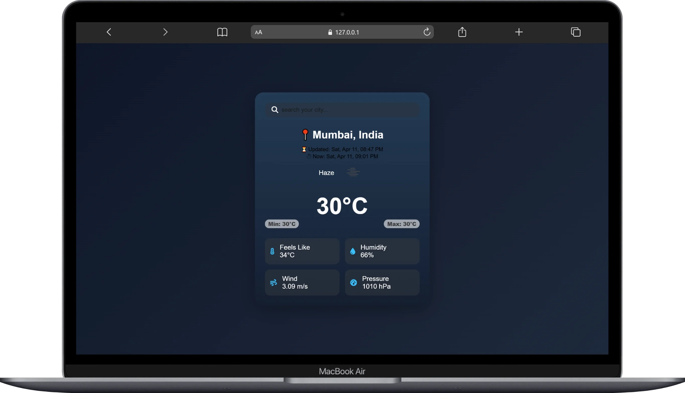
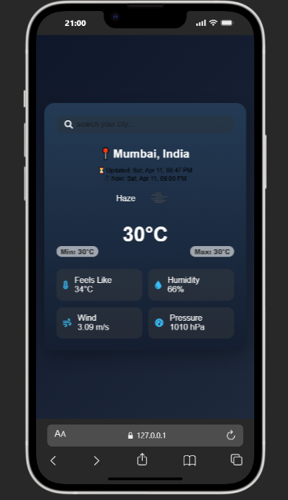

# 🌦 Weather App – Live Location Weather Tracker

🚀 **Live Demo:**
🔗 [Live Demo](https://weather.webdevzone.in)

🚀 A modern and responsive weather application that shows real-time weather data based on live location or searched city.
Built to practice API integration, geo-location, and dynamic UI updates.

---

## 📌 Tech Stack

- 🧱 HTML5
- 🎨 CSS3
- ⚙️ JavaScript
- 🌐 Weather API (OpenWeather)

---

## ✨ Features

- 📍 Live location weather detection
- 🔍 Search weather by city name
- 🌡 Real-time temperature, humidity, wind & pressure
- 🕒 Live time + last updated time display
- 🌧 Dynamic weather UI (sun / cloud / rain / night)
- 🎨 Animated background effects
- ⚡ Fast API-based data fetching
- 📱 Fully responsive design
- 💾 Last searched city saved (localStorage)
- ❌ Invalid city error handling

---

## 🚀 Key Highlights

- 📍 Geo-location Support – Detects user’s current location
- 🌦 Dynamic UI – Changes background based on weather
- ⏱ Live Clock – Shows real-time + API update time
- 🎨 Modern UI – Glass-morphism + smooth animations
- 🔌 API Integration – Async/await + Fetch API
- 💾 LocalStorage – Saves last searched city
- 🧠 Clean Code – Structured & beginner-friendly

---

## 📸 Screenshots

> 
> 

---

## 🛠️ Installation

Follow these steps to run the project locally:

```bash
# 1. Clone the repository
git clone - https://github.com/webdev-desktop/Weather_Website.git

# 2. Go into the project folder
cd Weather_Website

# 3. Open index.html in your browser
```

---

## ▶️ Usage

1. Allow location access 📍 (for live weather)
2. Or search any city 🔍
3. View temperature, humidity, wind & pressure
4. See dynamic UI based on weather 🌦
5. Check live time ⏱ + last updated time
6. Enjoy smooth animations 🚀

---

## 🔮 Future Improvements

- 🌙 Dark / Light mode toggle
- 📅 5-day weather forecast
- 📊 Weather charts (temperature trends)
- 🔔 Weather alerts system
- 🌐 Multi-language support
- 📍 Multiple saved locations

---

## 🤝 Contribution

Contributions are welcome!

```bash
# Fork the repo
# Create a new branch
git checkout -b feature/your-feature

# Commit changes
git commit -m "Add your feature"

# Push to branch
git push origin feature/your-feature
```

Then open a Pull Request 🚀

---

## 👨‍💻 Author

**Apurv**

- [GitHub](https://github.com/webdev-desktop)

---

## 📄 License

This project is licensed under the **MIT License**.

---

## ⭐ Support

If you like this project, don’t forget to star ⭐ the repo and share it!
